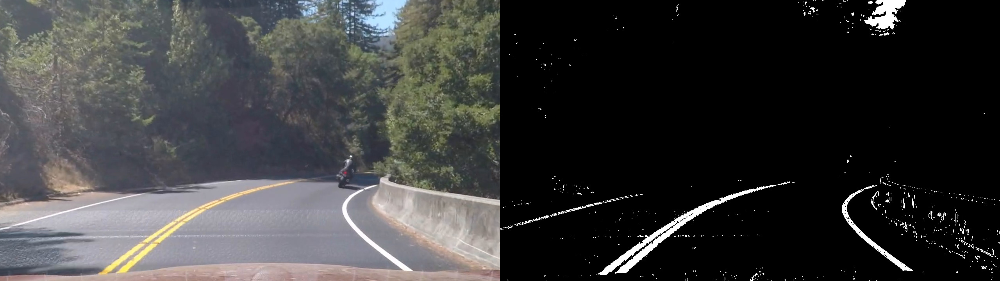

 

**Advanced Lane Finding Project**
=================================

 

The goals of the project are the following:

-   Compute the camera calibration matrix and distortion coefficients given a
    set of chessboard images.
    
-   Apply a distortion correction to raw images.

-   Use color and gradients transforms to create a thresholded binary image.

-   Apply a perspective transform to birds-eye view binary image.

-   Detect lane pixels and fit to find the lane boundary.

-   Determine the curvature of the lane and vehicle position with respect to
    center.
    
-   Warp the detected lane boundaries back onto the original image.

-   Visualize the lane boundaries and numerical estimation of lane curvature and
    vehicle position.

 

Camera Calibration
------------------

 

I started by preparing "object points", which will be the (x, y, z) coordinates of
the chessboard corners in the world. 

It is assumed that the chessboard is fixed on the (x, y) plane at z=0, such that the object points are the same for each calibration image. Thus, `objp` is just a replicated array of coordinates, and `objpoints` will be appended with a copy of it every time I successfully detect all chessboard corners in a test image. `imgpoints` will be appended with the
(x, y) pixel position of each of the corners in the image plane with each
successful chessboard detection.


| Sourcecode Reference    |  |
|-----------|-------------|
| File  | `pre_processing.py`  |
| Method  | `PreProcessing.get_calibration_params()`      |


The algorithm is as follows:

-   Read the source image.
-   Find the `corners` of the image using opencv `findChessboardCorners`() and
    append the `corners` in the image points.
-   Find the calibration matrix and distortion coefficients using opencv
    `calibrateCamera`().
-   Save the calibration parameters as a `pickle` file for reuse later.
    
The results of the Camera Calibration and Distortion Removal:

Right side: `Original Image`. Left side: `Undistorted Image`


Pipeline
------------------


#### 1. Distortion Correction:

| Sourcecode Reference    |  |
|-----------|-------------|
| File  | `pre_processing.py`  |
| Method  | `PreProcessing.load_calibration_params()`      |
| Method  | `PreProcessing.get_undistorted_image()`   |


The Algorithm for thresholding is as follows:

-   Load the claibration parameters i.e `Camera Matrix` and `Distortion Coefficient` from a pickle file.
-	Apply calibration parameters on the source image to remove distortion using
    opencv `undistort`().
    

To demonstrate this step, I will describe how I apply the distortion correction
to one of the test images like this one:

Right side: `Original Image`. Left side: `Calibrated Image`


#### 2. Color and Gradient Thresholding:

| Sourcecode Reference    |  |
|-----------|-------------|
| File  | `pre_processing.py`  |
| Method  | `PreProcessing.get_binary_images()`      |


The Algorithm for thresholding is as follows:

-   Apply grayscale Apply Sobel X using opencv `Sobel` method.
-   Find the 8bit Sobel and binary Sobel using `np.uint8(255 * sx_abs /
    np.max(sx_abs))`.
-   Get binary R channel from RGB using
    `r_binary[(r>=rgb_thresh[0])&(r<=rgb_thresh[1])]=1`.
-   Get binary S channel from HLS.
-   Resultant is the merger of binary Sobel and binary S channel AND'd with
    binary R channel.





 

#### 3. Perspective Transform:

| Sourcecode Reference    |  |
|-----------|-------------|
| File  | `perspective_transform.py`  |
| Method  | `PerspectiveTransform.get_perspective_points()`      |
| Method  | `PerspectiveTransform.get_wrapped_image()`   |


-   The implementation method to get the perspective transform `src` and `dst`
    points is `get_perspective_points() `. This method takes as input `input_image` and
    optional `offset` values.

-   The implementation method to get the warped image using `src` and `dst`
    points is `get_wrapped_image() `. The method takes as input `input_image`,
    `source` and `destination` points and returns `warped` image.

-   The values I chose for `src` and `dst` points is such that it covers the
    Lane Trapezoid in both original and warped images.


This resulted in the following source and destination points:

| Source    | Destination |
|-----------|-------------|
| 100, 720  | 100, 1280   |
| 585, 450  | 100, 0      |
| 695, 450  | 620, 0      |
| 1180, 720 | 620, 1280   |

 

I verified that my perspective transform was working as expected by drawing the
`src` and `dst` points onto a test image and its warped counterpart to verify
that the lines appear parallel in the warped image.

 


#### 4. Lane Lines Detection using Histogram and Sliding Window Algorithm:


| Sourcecode Reference    |  |
|-----------|-------------|
| File  | `lanes_fitting.py`  |
| Method  | `LanesFitting.get_lanes_fit()`      |
| Method  | `LanesFitting.update_lanes_fit()`   |

The Algorithm for detecting lane lines is as follows:

-   Take `histogram` of the bottom half of the image.
-	Find peaks in left and right of the image. These peaks represent the lanes.
-	Identify `x` and `y` positions of all `nonzero` pixel points.
-	Loop over `windows` and for each `window`:
	- Identify window boundary.
    - Find nonzero pixel in `x` and `y` within window boundary and append them in `good_indices` list.
-	Extract the `left` and `right` `xy` position from `nonzero` pixel using `good_indices`.
-	Apply 2nd order polynomial to the left and right pixel positions. This gives us the left and right lines polynomial fit.


The Algorithm for updating the lane lines detected is as follows:
-	Since we have already found lane lines in the previous step, we don't need to perform blind search each time, instead we can use the information of previously found lines fits and search in the region around them.
-	Get left and right indices for nonzero pixels.
-	Get left and right pixel positions from nonzero pixels.
-	Apply 2nd order polynomial to the left and right pixel positions.


#### 5. Radius of curvature and vehicle distance from center lane:

| Sourcecode Reference    |  |
|-----------|-------------|
| File  | `metrics.py`  |
| Method  | `Metrics.get_curvature_radius()`      |
| Method  | `Metrics.get_distance_from_center()`   |

Algorithm for finding radius of curvature is as follows:

-	Define pixel to meter conversion factor.
-	Apply conversion factor on  left and right polynomial fits. This gives us polynomials in meter.
-	Find radius of curvature ``` R = ((1+ (f')**2)**1.5)/f'' ``` where `f'` means 1st derivative and `f''` means 2nd derivative.


Algorithm for finding vehicle distance from center lane is as follows:
-	Get `car position` which is center of the image.
-	Get `lanes width` by taking difference of left and right polynomial fits.
-	Get `lane center` using midpoint left and right polynomial fits.
-	Get `distance from center` by taking difference of `car position` and `lane center`.
-	Get distance in meters by multplying `distance from center` with conversion factor.

#### 6. Results:

I implemented this step in lines \# through \# in my code in
`yet_another_file.py` in the function `map_lane()`. Here is an example of my
result on a test image:


Here is the video of the complete pipeline:

[](http://www.youtube.com/watch?v=N2Xmli0xVmA)
### Discussion

#### 1. Briefly discuss any problems / issues you faced in your implementation of this project. Where will your pipeline likely fail? What could you do to make it more robust?

Here I'll talk about the approach I took, what techniques I used, what worked
and why, where the pipeline might fail and how I might improve it if I were
going to pursue this project further.
