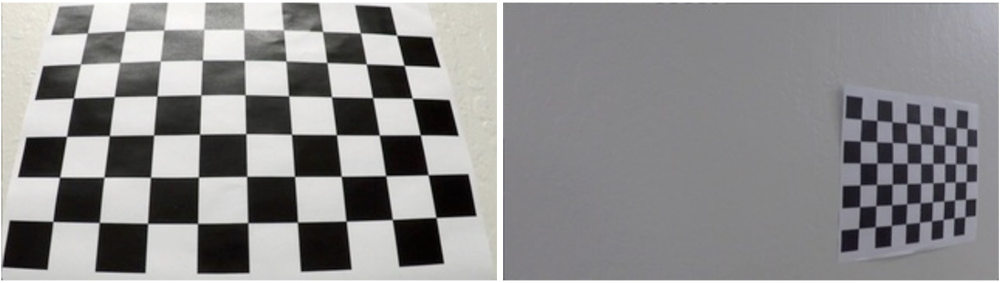
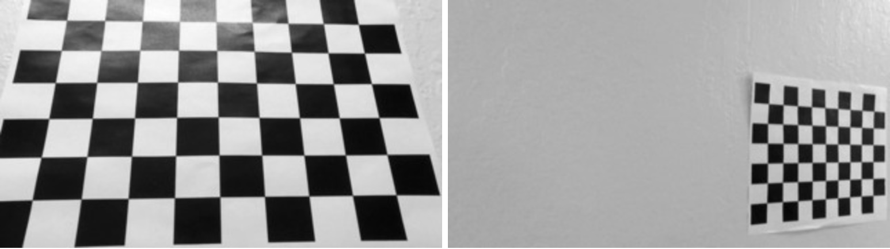
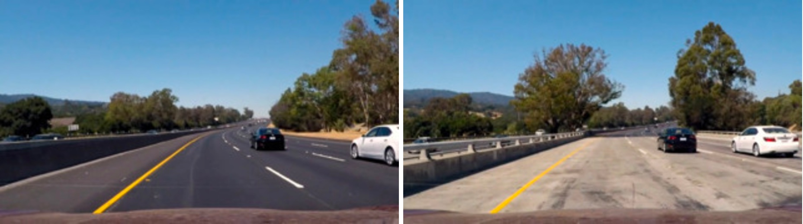
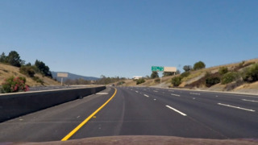
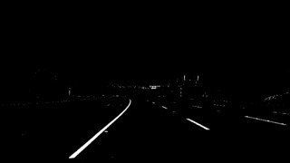

 

**Advanced Lane Finding Project**
=================================

 

The goals of the project are the following:

-   Compute the camera calibration matrix and distortion coefficients given a
    set of chessboard images.

-   Apply a distortion correction to raw images.

-   Use color and gradients transforms to create a thresholded binary image.

-   Apply a perspective transform to birds-eye view binary image.

-   Detect lane pixels and fit to find the lane boundary.

-   Determine the curvature of the lane and vehicle position with respect to
    center.

-   Warp the detected lane boundaries back onto the original image.

-   Visualize the lane boundaries and numerical estimation of lane curvature and
    vehicle position.

 

Camera Calibration
------------------

 

I start by preparing "object points", which will be the (x, y, z) coordinates of
the chessboard corners in the world. Here I am assuming the chessboard is fixed
on the (x, y) plane at z=0, such that the object points are the same for each
calibration image. Thus, `objp` is just a replicated array of coordinates, and
`objpoints` will be appended with a copy of it every time I successfully detect
all chessboard corners in a test image. `imgpoints` will be appended with the
(x, y) pixel position of each of the corners in the image plane with each
successful chessboard detection.

 

The algorithm is as follows:

-   Read the source image

-   Find the `corners` of the image using opencv `findChessboardCorners`() and
    append the `corners` in the image points.

-   Find the calibration matrix and distortion coefficients using opencv
    `calibrateCamera`().

-   Save the calibration parameters as a `pickle` file for reuse later.

-   Apply calibration parameters on the source image to remove distortion using
    opencv `undistort`().

``` python
        imgs = glob.glob("camera_cal/*.jpg")
        # img_pts --> 2D coordinates in image
        # obj_pts --> 3D coordinates in real world
        img_pts, obj_pts, = [], []
        # to create a matrix of 4x5 --> np.mgrid[0:4, 0:5]
        obj_pt = np.zeros(shape=(nx * ny, channels), dtype=np.float32)
        obj_pt[:, :2] = np.mgrid[0:nx, 0:ny].T.reshape(-1, 2)
        # loop over all images and append the image and object points
        for file_name in imgs:
            # read the image
            img = mpimg.imread(file_name)
            # grayscale
            gray = cv.cvtColor(img, cv.COLOR_RGB2GRAY)
            # find the corners
            found, corners = cv.findChessboardCorners(image=gray, patternSize=(nx, ny))
            if found is True:
                obj_pts.append(obj_pt)
                img_pts.append(corners)
                # draw the found corner points in the image
                draw_pts = np.copy(img)
                cv.drawChessboardCorners(image=draw_pts,
                                         patternSize=(nx, ny),
                                         corners=corners,
                                         patternWasFound=found)

        # use an image to find camera matrix and distortion coef
        test_img = mpimg.imread("camera_cal/calibration4.jpg")
        # find camera matrix and distortion coef
        ret, camera_matrix, dist_coef, rot_vector, trans_vector = cv.calibrateCamera(objectPoints=obj_pts, 
                                                                                     imagePoints=img_pts, 
                                                                                     imageSize=test_img.shape[0:2],
                                                                                     cameraMatrix=None,
                                                                                     distCoeffs=None)
        # undistorted image
        undistorted = cv.undistort(src=img,
                                   cameraMatrix=camera_matrix,
                                   distCoeffs=dist_coef,
                                   dst=None,
                                   newCameraMatrix=camera_matrix)
```

The code for this step is contained in the PreProcessing.get_calibration_params
and PreProcessing.get_undistorted_image methods in
`implementation/pre_processing.py`

The result of the Camera Calibration and Distortion Removal:

Original Images



Undistorted Images



### Pipeline (single images)

#### 1. Provide an example of a distortion-corrected image.

To demonstrate this step, I will describe how I apply the distortion correction
to one of the test images like this one:




#### 2. Color and Gradient Thresholding:

 

The Algorithm for thresholding is as follows:

-   Apply grayscale Apply Sobel X using opencv `Sobel` method.

-   Find the 8bit Sobel and binary Sobel using `np.uint8(255 * sx_abs /
    np.max(sx_abs))`.

-   Get binary R channel from RGB using
    `r_binary[(r>=rgb_thresh[0])&(r<=rgb_thresh[1])]=1`.

-   Get binary S channel from HLS.

-   Resultant is the merger of binary Sobel and binary S channel AND'd with
    binary R channel.

 

The code for this step is contained in the PreProcessing.get_binary_image in
implementation/pre_processing.py

``` python
# grayscale
gray = cv.cvtColor(img, cv.COLOR_RGB2GRAY)
gray_binary = np.zeros_like(gray)
gray_binary[(gray >= 20) & (gray <= 80)] = 1

# sobelx gradient threshold
dx, dy = (1, 0)
sx = cv.Sobel(gray, cv.CV_64F, dx, dy, ksize=3)
sx_abs = np.absolute(sx)
sx_8bit = np.uint8(255 * sx_abs / np.max(sx_abs))
sx_binary = np.zeros_like(sx_8bit)
sx_binary[(sx_8bit > sx_thresh[0]) & (sx_8bit <= sx_thresh[1])] = 1

# RGB color space
r, g, b = img[:, :, 0], img[:, :, 1], img[:, :, 2]
r_binary = np.zeros_like(r)
r_binary[(r >= rgb_thresh[0]) & (r <= rgb_thresh[1])] = 1

# HLS color space
hls = cv.cvtColor(img, cv.COLOR_RGB2HLS)
h, l, s = hls[:, :, 0], hls[:, :, 1], hls[:, :, 2]
s_binary = np.zeros_like(s)
s_binary[(s >= hls_thresh[0]) & (s <= hls_thresh[1])] = 1

# resultant of r, s and sx
binary_image = np.zeros_like(sx_binary)
binary_image[((sx_binary == 1) | (s_binary == 1)) & (r_binary == 1)] = 1
# Helper.save_binarized_image(img, binary_image)
return binary_image
```





 

#### 3. Describe how (and identify where in your code) you performed a perspective transform and provide an example of a transformed image.

 

-   The implementation method to get the perspective transform `src` and `dst`
    points is `PerspectiveTransform.get_perspective_points `in file
    `perspective_transform.py. `The method takes as input `input_image` and
    optional `offset` values.

-   The implementation method to get the warped image using `src` and `dst`
    points is `PerspectiveTransform.get_wrapped_image `in file
    `perspective_transform.py`. The method takes as input `input_image`,
    `source` and `destination` points and returns `warped` image.

-   The values I chose for `src` and `dst` points is such that it covers the
    Lane Trapezoid in both original and warped images.

 

Here is the implementation snippet:

``` python
# y tilt --> img_height / 2 + offset
# x tilt --> spacing between both lanes
x_tilt, y_tilt = 55, 450
img_height, img_width = img.shape[0], img.shape[1]
img_center = (img_width / 2)

# covers the lane in the road
src = np.float32([
    [offset, img_height],
    [img_center - x_tilt, y_tilt],
    [img_center + x_tilt, y_tilt],
    [img_width - offset, img_height]
])

# forms a bird eye
dst = np.float32([
    [offset, img_width],
    [offset, 0],
    [img_height - offset, 0],
    [img_height - offset, img_width]
])
```

 

This resulted in the following source and destination points:

| Source    | Destination |
|-----------|-------------|
| 100, 720  | 100, 1280   |
| 585, 450  | 100, 0      |
| 695, 450  | 620, 0      |
| 1180, 720 | 620, 1280   |

 

I verified that my perspective transform was working as expected by drawing the
`src` and `dst` points onto a test image and its warped counterpart to verify
that the lines appear parallel in the warped image.

 


#### 4. Describe how (and identify where in your code) you identified lane-line pixels and fit their positions with a polynomial?

Then I did some other stuff and fit my lane lines with a 2nd order polynomial
kinda like this:


#### 5. Describe how (and identify where in your code) you calculated the radius of curvature of the lane and the position of the vehicle with respect to center.

I did this in lines \# through \# in my code in `my_other_file.py` 

#### 6. Provide an example image of your result plotted back down onto the road such that the lane area is identified clearly.

I implemented this step in lines \# through \# in my code in
`yet_another_file.py` in the function `map_lane()`. Here is an example of my
result on a test image:


### Pipeline (video)

#### 1. Provide a link to your final video output. Your pipeline should perform reasonably well on the entire project video (wobbly lines are ok but no catastrophic failures that would cause the car to drive off the road!).

Here's a [link to my video result](./project_video.mp4)

### Discussion

#### 1. Briefly discuss any problems / issues you faced in your implementation of this project. Where will your pipeline likely fail? What could you do to make it more robust?

Here I'll talk about the approach I took, what techniques I used, what worked
and why, where the pipeline might fail and how I might improve it if I were
going to pursue this project further.
