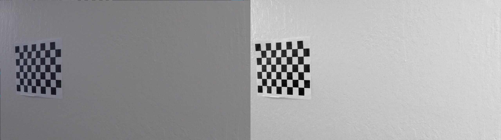
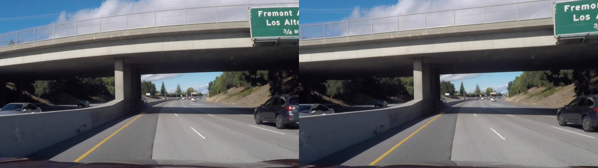
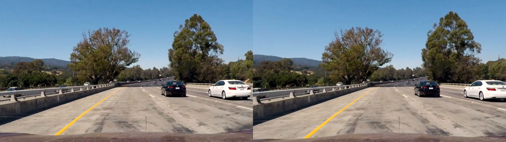
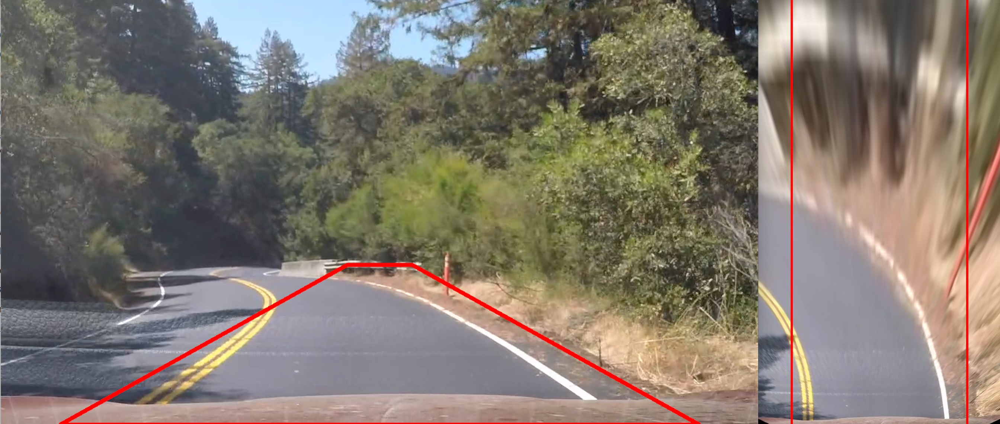
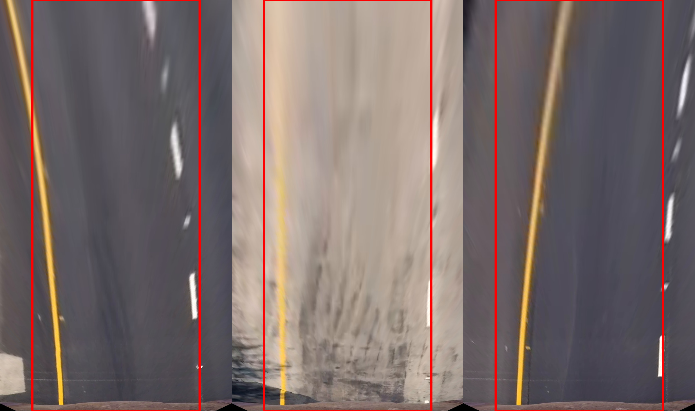
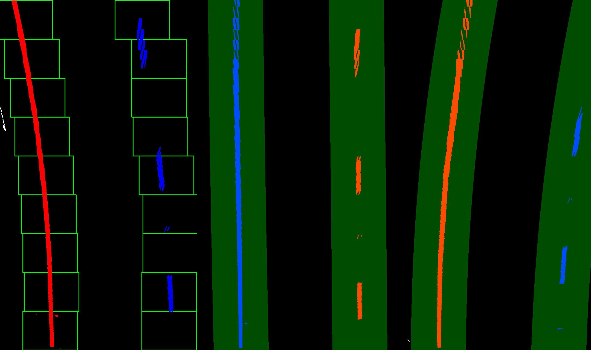
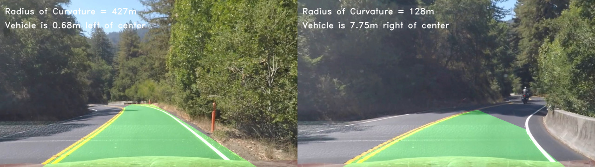

 

**Advanced Lane Finding Project**
=================================

 

The goals of the project are the following:

-   Compute the camera calibration matrix and distortion coefficients given a
    set of chessboard images.
    
-   Apply a distortion correction to raw images.

-   Use color and gradients transforms to create a thresholded binary image.

-   Apply a perspective transform to birds-eye view binary image.

-   Detect lane pixels and fit to find the lane boundary.

-   Determine the curvature of the lane and vehicle position with respect to
    center.
    
-   Warp the detected lane boundaries back onto the original image.

-   Visualize the lane boundaries and numerical estimation of lane curvature and
    vehicle position.

 

Camera Calibration
------------------

 

I started by preparing "object points", which will be the (x, y, z) coordinates of
the chessboard corners in the world. 

It is assumed that the chessboard is fixed on the (x, y) plane at z=0, such that the object points are the same for each calibration image. Thus, `objp` is just a replicated array of coordinates, and `objpoints` will be appended with a copy of it every time I successfully detect all chessboard corners in a test image. `imgpoints` will be appended with the
(x, y) pixel position of each of the corners in the image plane with each
successful chessboard detection.


| Sourcecode Reference    |  |
|-----------|-------------|
| File  | `pre_processing.py`  |
| Method  | `PreProcessing.get_calibration_params()`      |


The algorithm is as follows:

-   Read the source image.
-   Find the `corners` of the image using opencv `findChessboardCorners`() and
    append the `corners` in the image points.
-   Find the calibration matrix and distortion coefficients using opencv
    `calibrateCamera`().
-   Save the calibration parameters as a `pickle` file for reuse later.
    
``` python
imgs = glob.glob("camera_cal/*.jpg")  # img_pts --> 2D coordinates in image

# obj_pts --> 3D coordinates in real world
img_pts, obj_pts, = [], []

# to create a matrix of 4x5 --> np.mgrid[0:4, 0:5]
obj_pt = np.zeros(shape=(nx * ny, channels), dtype=np.float32)
obj_pt[:, :2] = np.mgrid[0:nx, 0:ny].T.reshape(-1, 2)

# loop over all images and append the image and object points
for file_name in imgs:
    # read the image
    img = mpimg.imread(file_name)
    # grayscale
    gray = cv.cvtColor(img, cv.COLOR_RGB2GRAY)
    # find the corners
    found, corners = cv.findChessboardCorners(image=gray, patternSize=(nx, ny))
    if found is True:
        obj_pts.append(obj_pt)
        img_pts.append(corners)
        # draw the found corner points in the image
        draw_pts = np.copy(img)
        cv.drawChessboardCorners(image=draw_pts,
                                 patternSize=(nx, ny),
                                 corners=corners,
                                 patternWasFound=found)

# use an image to find camera matrix and distortion coef
test_img = mpimg.imread("camera_cal/calibration4.jpg")

# find camera matrix and distortion coef
ret, camera_matrix, dist_coef, rot_vector, trans_vector = cv.calibrateCamera(objectPoints=obj_pts,
                                                                             imagePoints=img_pts,
                                                                             imageSize=test_img.shape[0:2],
                                                                             cameraMatrix=None,
                                                                             distCoeffs=None)
# store calibration params as pickle to avoid recalibration
PreProcessing.save_calibration_params(camera_matrix, dist_coef)
```

The results of the Camera Calibration and Distortion Removal:

Right side: `Original Image`. Left side: `Undistorted Image`





Pipeline
------------------


#### 1. Distortion Correction:

| Sourcecode Reference    |  |
|-----------|-------------|
| File  | `pre_processing.py`  |
| Method  | `PreProcessing.load_calibration_params()`      |
| Method  | `PreProcessing.get_undistorted_image()`   |


The Algorithm for thresholding is as follows:

-   Load the claibration parameters i.e `Camera Matrix` and `Distortion Coefficient` from a pickle file.
-	Apply calibration parameters on the source image to remove distortion using
    opencv `undistort`().
    
```python
# load calibration params from pickle or else find the params
camera_matrix, dist_coef = PreProcessing.load_calibration_params()

# undistorted image
undistorted = cv.undistort(src=img,
                           cameraMatrix=camera_matrix,
                           distCoeffs=dist_coef,
                           dst=None,
                           newCameraMatrix=camera_matrix)
```
To demonstrate this step, I will describe how I apply the distortion correction
to one of the test images like this one:

Right side: `Original Image`. Left side: `Calibrated Image`







#### 2. Color and Gradient Thresholding:

 
| Sourcecode Reference    |  |
|-----------|-------------|
| File  | `pre_processing.py`  |
| Method  | `PreProcessing.get_binary_images()`|


The Algorithm for thresholding is as follows:

-   Apply grayscale Apply Sobel X using opencv `Sobel` method.
-   Find the 8bit Sobel and binary Sobel using `np.uint8(255 * sx_abs /
    np.max(sx_abs))`.
-   Get binary R channel from RGB using
    `r_binary[(r>=rgb_thresh[0])&(r<=rgb_thresh[1])]=1`.
-   Get binary S channel from HLS.
-   Resultant is the merger of binary Sobel and binary S channel AND'd with
    binary R channel.


``` python
# grayscale
gray = cv.cvtColor(img, cv.COLOR_RGB2GRAY)
gray_binary = np.zeros_like(gray)
gray_binary[(gray >= 20) & (gray <= 80)] = 1

# sobelx gradient threshold
dx, dy = (1, 0)
sx = cv.Sobel(gray, cv.CV_64F, dx, dy, ksize=3)
sx_abs = np.absolute(sx)
sx_8bit = np.uint8(255 * sx_abs / np.max(sx_abs))
sx_binary = np.zeros_like(sx_8bit)
sx_binary[(sx_8bit > sx_thresh[0]) & (sx_8bit <= sx_thresh[1])] = 1

# RGB color space
r, g, b = img[:, :, 0], img[:, :, 1], img[:, :, 2]
r_binary = np.zeros_like(r)
r_binary[(r >= rgb_thresh[0]) & (r <= rgb_thresh[1])] = 1

# HLS color space
hls = cv.cvtColor(img, cv.COLOR_RGB2HLS)
h, l, s = hls[:, :, 0], hls[:, :, 1], hls[:, :, 2]
s_binary = np.zeros_like(s)
s_binary[(s >= hls_thresh[0]) & (s <= hls_thresh[1])] = 1

# resultant of r, s and sx
binary_image = np.zeros_like(sx_binary)
binary_image[((sx_binary == 1) | (s_binary == 1)) & (r_binary == 1)] = 1
# Helper.save_binarized_image(img, binary_image)
return binary_image
```


 

#### 3. Perspective Transform:

| Sourcecode Reference    |  |
|-----------|-------------|
| File  | `perspective_transform.py`  |
| Method  | `PerspectiveTransform.get_perspective_points()`      |
| Method  | `PerspectiveTransform.get_wrapped_image()`   |


-   The implementation method to get the perspective transform `src` and `dst`
    points is `get_perspective_points() `. This method takes as input `input_image` and
    optional `offset` values.

-   The implementation method to get the warped image using `src` and `dst`
    points is `get_wrapped_image() `. The method takes as input `input_image`,
    `source` and `destination` points and returns `warped` image.

-   The values I chose for `src` and `dst` points is such that it covers the
    Lane Trapezoid in both original and warped images.

 

``` python
# y tilt --> img_height / 2 + offset
# x tilt --> spacing between both lanes
x_tilt, y_tilt = 55, 450
img_height, img_width = img.shape[0], img.shape[1]
img_center = (img_width / 2)

# covers the lane in the road
src = np.float32([
    [offset, img_height],
    [img_center - x_tilt, y_tilt],
    [img_center + x_tilt, y_tilt],
    [img_width - offset, img_height]
])

# forms a bird eye
dst = np.float32([
    [offset, img_width],
    [offset, 0],
    [img_height - offset, 0],
    [img_height - offset, img_width]
])
```

 

This resulted in the following source and destination points:

| Source    | Destination |
|-----------|-------------|
| 100, 720  | 100, 1280   |
| 585, 450  | 100, 0      |
| 695, 450  | 620, 0      |
| 1180, 720 | 620, 1280   |

 

I verified that my perspective transform was working as expected by drawing the
`src` and `dst` points onto a test image and its warped counterpart to verify
that the lines appear parallel in the warped image.

 





#### 4. Lane Lines Detection using Histogram and Sliding Window Algorithm:


| Sourcecode Reference    |  |
|-----------|-------------|
| File  | `lanes_fitting.py`  |
| Method  | `LanesFitting.get_lanes_fit()`      |
| Method  | `LanesFitting.update_lanes_fit()`   |

The Algorithm for detecting lane lines is as follows:

-   Take `histogram` of the bottom half of the image.
-	Find peaks in left and right of the image. These peaks represent the lanes.
-	Identify `x` and `y` positions of all `nonzero` pixel points.
-	Loop over `windows` and for each `window`:
	- Identify window boundary.
    - Find nonzero pixel in `x` and `y` within window boundary and append them in `good_indices` list.
-	Extract the `left` and `right` `xy` position from `nonzero` pixel using `good_indices`.
-	Apply 2nd order polynomial to the left and right pixel positions. This gives us the left and right lines polynomial fit.

```python
# Take a histogram of the bottom half of the image
histogram = np.sum(img[np.int(img.shape[0] / 2):, :], axis=0)

# Create an output image to draw on and visualize the result
lanes_img = np.dstack((img, img, img)) * 255

# Find the peak of the left and right halves of the histogram
# These will be the starting point for the left and right lines
midpoint = np.int(histogram.shape[0] / 2)
leftx_base = np.argmax(histogram[:midpoint])
rightx_base = np.argmax(histogram[midpoint:]) + midpoint

# Choose the number of sliding windows
n_windows = 9

# Set height of windows
window_height = np.int(img.shape[0] / n_windows)

# Identify the x and y positions of all nonzero pixels in the image
nonzero = img.nonzero()
nonzero_x, nonzero_y = np.array(nonzero[1]), np.array(nonzero[0])

# Current positions to be updated for each window
leftx_current, rightx_current = leftx_base, rightx_base

# Set the width of the windows +/- margin
margin = 100

# Set minimum number of pixels found to recenter window
min_pixels = 50

left_lane_inds, right_lane_inds = [], []

for window in range(n_windows):
    # Identify window boundaries in x and y (and right and left)
    win_y_low = img.shape[0] - (window + 1) * window_height
    win_y_high = img.shape[0] - window * window_height

    win_xleft_low, win_xleft_high = leftx_current - margin, leftx_current + margin
    win_xright_low, win_xright_high = rightx_current - margin, rightx_current + margin

    # Draw the windows on the visualization image
    cv2.rectangle(lanes_img, (win_xleft_low, win_y_low), (win_xleft_high, win_y_high), (0, 255, 0), 2)
    cv2.rectangle(lanes_img, (win_xright_low, win_y_low), (win_xright_high, win_y_high), (0, 255, 0), 2)

    # Identify the nonzero pixels in x and y within the window
    good_left_inds = ((nonzero_y >= win_y_low) & (nonzero_y < win_y_high) & (nonzero_x >= win_xleft_low) & (
        nonzero_x < win_xleft_high)).nonzero()[0]
    good_right_inds = ((nonzero_y >= win_y_low) & (nonzero_y < win_y_high) & (nonzero_x >= win_xright_low) & (
        nonzero_x < win_xright_high)).nonzero()[0]

    # Append these indices to the lists
    left_lane_inds.append(good_left_inds), right_lane_inds.append(good_right_inds)

    # If you found > min_pixels pixels, recenter next window on their mean position
    if len(good_left_inds) > min_pixels:
        leftx_current = np.int(np.mean(nonzero_x[good_left_inds]))
    if len(good_right_inds) > min_pixels:
        rightx_current = np.int(np.mean(nonzero_x[good_right_inds]))

# Concatenate the arrays of indices
left_lane_inds = np.concatenate(left_lane_inds)
right_lane_inds = np.concatenate(right_lane_inds)

# Extract left and right line pixel positions
left_x, left_y = nonzero_x[left_lane_inds], nonzero_y[left_lane_inds]
right_x, right_y = nonzero_x[right_lane_inds], nonzero_y[right_lane_inds]

# Fit a second order polynomial to each lane
left_fit = np.polyfit(left_y, left_x, 2)
right_fit = np.polyfit(right_y, right_x, 2)
```


The Algorithm for updating the lane lines detected is as follows:
-	Since we have already found lane lines in the previous step, we don't need to blindly search each time, instead we can use the information of previously found lines fits and search in the region around them.
-	Get left and right indices for nonzero pixels.
-	Get left and right pixel positions from nonzero pixels.
-	Apply 2nd order polynomial to the left and right pixel positions.

```python
left_lane_inds = (
    (nonzerox > (left_fit[0] * (nonzeroy ** 2) + left_fit[1] * nonzeroy + left_fit[2] - margin)) & (
        nonzerox < (left_fit[0] * (nonzeroy ** 2) + left_fit[1] * nonzeroy + left_fit[2] + margin)))
right_lane_inds = (
    (nonzerox > (right_fit[0] * (nonzeroy ** 2) + right_fit[1] * nonzeroy + right_fit[2] - margin)) & (
        nonzerox < (right_fit[0] * (nonzeroy ** 2) + right_fit[1] * nonzeroy + right_fit[2] + margin)))

# Again, extract left and right line pixel positions
leftx = nonzerox[left_lane_inds]
lefty = nonzeroy[left_lane_inds]
rightx = nonzerox[right_lane_inds]
righty = nonzeroy[right_lane_inds]

# Fit a second order polynomial to each
left_fit = np.polyfit(lefty, leftx, 2)
right_fit = np.polyfit(righty, rightx, 2)
```





#### 5. Radius of curvature and vehicle distance from center lane:

| Sourcecode Reference    |  |
|-----------|-------------|
| File  | `metrics.py`  |
| Method  | `Metrics.get_curvature_radius()`      |
| Method  | `Metrics.get_distance_from_center()`   |

Algorithm for finding radius of curvature is as follows:

-	Define pixel to meter conversion factor.
-	Apply conversion factor on  left and right polynomial fits. This gives us polynomials in meter.
-	Find radius of curvature ``` R = ((1+ (f')**2)**1.5)/f'' ``` where `f'` means 1st derivative and `f''` means 2nd derivative.

```python
img_height = img.shape[0]  # get evenly spaces array over the range of image height
ploty = np.linspace(0, img_height - 1, img_height)
y = np.max(ploty)

# pixel to meter factor
y_meter_per_pixel = 30 / img_height
x_meter_per_pixel = 3.7 / (img_height - 20)

# xy pixel positions for left and right lanes
rightx, righty = right
leftx, lefty = left

# left and right lanes in meter
left_fit_meter = np.polyfit(lefty * y_meter_per_pixel,
                            leftx * x_meter_per_pixel, 2)

right_fit_meter = np.polyfit(righty * y_meter_per_pixel,
                             rightx * x_meter_per_pixel, 2)

# using r = ((1+(f')^2)^1.5)/f''
left_radius = (1 + (2 * left_fit_meter[0] * y * y_meter_per_pixel + left_fit_meter[1]) ** 2) ** (3 / 2)
left_radius /= np.absolute(2 * left_fit_meter[0])
right_radius = (1 + (2 * right_fit_meter[0] * y * y_meter_per_pixel + right_fit_meter[1]) ** 2) ** (3 / 2)
right_radius /= np.absolute(2 * right_fit_meter[0])
```

Algorithm for finding vehicle distance from center lane is as follows:
-	Get `car position` which is center of the image.
-	Get `lanes width` by taking difference of left and right polynomial fits.
-	Get `lane center` using midpoint left and right polynomial fits.
-	Get `distance from center` by taking difference of `car position` and `lane center`.
-	Get distance in meters by multplying `distance from center` with conversion factor.

```python

# image dimensions
img_height, img_width = img.shape[0], img.shape[1]  # pixel to meter factor
x_meter_per_pixel = 3.7 / (img_height - 20)

# camera is mounted at the center of the car
car_position = img_width / 2

# left and right polynomial fits
right_fit, left_fit = fit

# lane width in which car is being driven
lane_width = abs(left_fit - right_fit)

# lane center is the midpoint at the bottom of the image
lane_center = (left_fit + right_fit) / 2

# how much car is away from lane center
center_distance = (car_position - lane_center) * x_meter_per_pixel
```

#### 6. Provide an example image of your result plotted back down onto the road such that the lane area is identified clearly.

I implemented this step in lines \# through \# in my code in
`yet_another_file.py` in the function `map_lane()`. Here is an example of my
result on a test image:





Here is the video the complete pipeline:

[](http://www.youtube.com/watch?v=N2Xmli0xVmA)
### Discussion

#### 1. Briefly discuss any problems / issues you faced in your implementation of this project. Where will your pipeline likely fail? What could you do to make it more robust?

Here I'll talk about the approach I took, what techniques I used, what worked
and why, where the pipeline might fail and how I might improve it if I were
going to pursue this project further.
